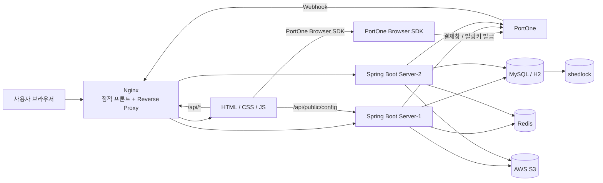
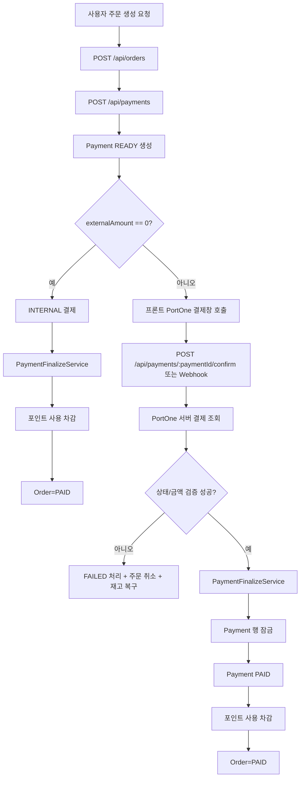
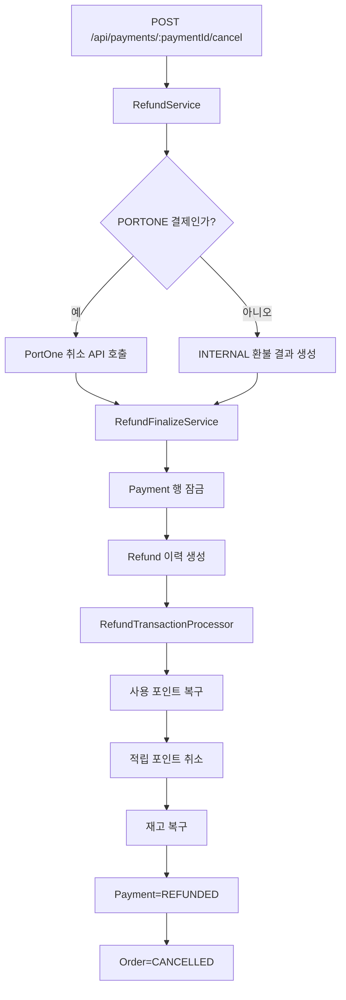
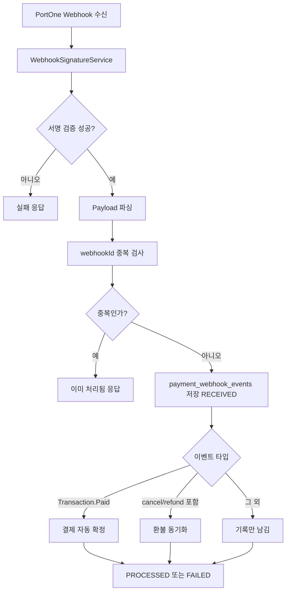
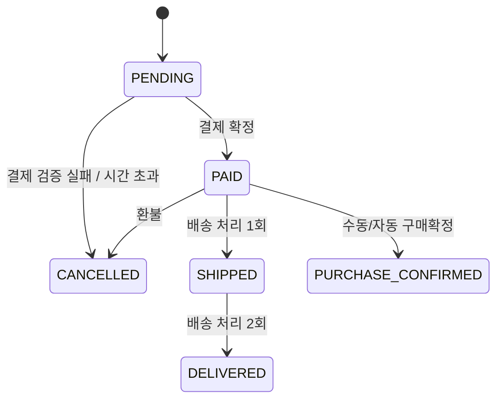
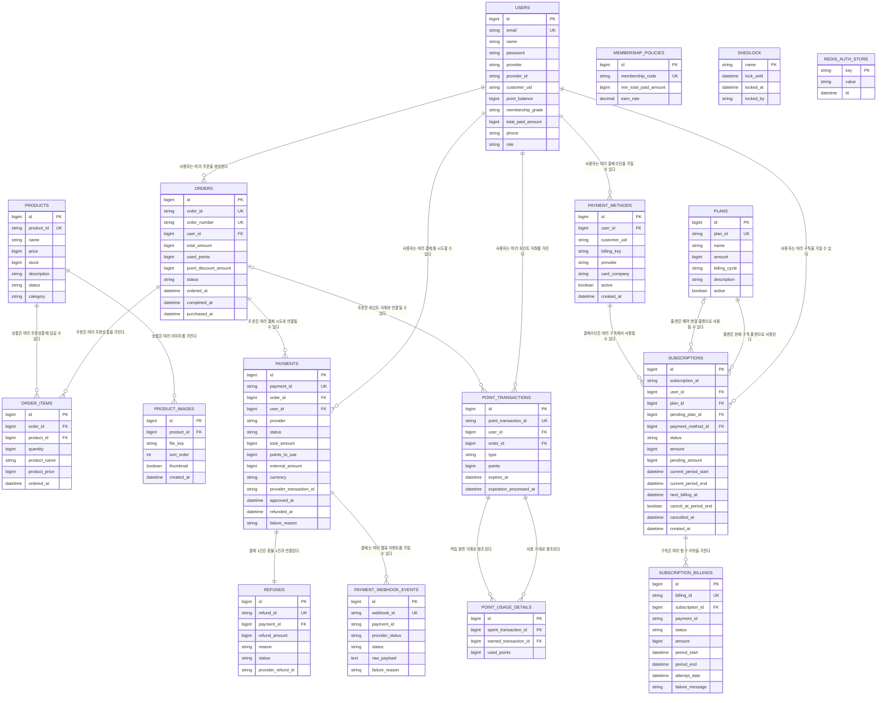

# 🏪 yareyare 결제 시스템 프로젝트

> **PortOne 일반결제 + 포인트 결제 + 환불 + 정기구독 + 웹훅 + 스케줄러를 하나의 흐름으로 통합한 커머스 플랫폼**

---

## ✨ 프로젝트 한 줄 소개

**yareyare**는 상품 주문부터 일반 결제, 포인트 결제, 환불, 멤버십 적립, 정기 구독 청구, 결제 웹훅 동기화, 운영 스케줄러까지 한 번에 다루는 **통합 커머스 결제 플랫폼**입니다.

### 🔑 핵심 키워드
`커머스` · `PortOne` · `포인트` · `환불` · `구독/정기청구` · `웹훅` · `스케줄러`

---

## 📚 목차

- [1. 프로젝트 개요](#1-프로젝트-개요)
- [2. 주요 기능](#2-주요-기능)
- [3. 기술 스택](#3-기술-스택)
- [4. 저장소 / 프로젝트 구조](#4-저장소--프로젝트-구조)
- [5. 설정 파일과 운영 파일](#5-설정-파일과-운영-파일)
- [6. 아키텍처 설계](#6-아키텍처-설계)
- [7. 도메인 관계 / ERD](#7-도메인-관계--erd)
- [8. API 명세](#8-api-명세)
- [9. 인증 / 인가 방식](#9-인증--인가-방식)
- [10. 결제 처리 설계](#10-결제-처리-설계)
- [11. 환불 처리 설계](#11-환불-처리-설계)
- [12. 웹훅 처리 설계](#12-웹훅-처리-설계)
- [13. 스케줄러 설계](#13-스케줄러-설계)
- [14. 초기 데이터 / 데모 계정](#14-초기-데이터--데모-계정)
- [15. 실행 방법](#15-실행-방법)
- [16. 트러블슈팅](#16-트러블슈팅)
- [17. 프로젝트를 통해 배운 점](#17-프로젝트를-통해-배운-점)

---

## 1. 프로젝트 개요

### 🧾 서비스 개요
이 프로젝트는 크게 두 가지 축으로 구성됩니다.

1. **일반 커머스 흐름**
   - 상품 조회
   - 주문 생성
   - 결제 시도 생성
   - PortOne 결제 또는 포인트 전액 결제
   - 주문 상태 변경
   - 환불
   - 포인트 적립/차감/복구/만료

2. **구독 커머스 흐름**
   - 플랜 조회
   - 빌링키 등록
   - 구독 생성
   - 수동 청구
   - 자동 정기 청구
   - 예약 해지 / 해지 완료
   - 청구 실패 시 구독 정지

### 👤 사용자 관점에서 제공하는 흐름

#### 일반 사용자
- 회원가입 / 로그인 / OAuth2 로그인(구글, 카카오)
- 내 정보 / 내 포인트 / 내 등급 조회
- 상품 목록 / 상품 상세 조회
- 주문 생성
- 결제 시도 생성 후 PortOne 결제창 호출
- 결제 확정
- 내 주문 목록 / 상세 조회
- 결제 취소(환불) 요청
- 구독 플랜 조회 / 구독 생성 / 구독 상태 변경 / 청구 이력 조회

#### 관리자
- 별도 **관리자 세션 로그인**
- 전체 주문 조회
- 주문 배송 상태 변경

#### 시스템
- PortOne 웹훅 수신 및 서명 검증
- 결제 시간 초과 주문 정리
- 포인트 만료 처리
- 구매 확정 자동 처리
- 구독 자동 청구 및 예약 해지 완료 처리
- 멀티 인스턴스 환경에서 ShedLock으로 스케줄 중복 방지

---

## 2. 주요 기능

### 🔐 2-1. 인증 / 인가
- **일반 사용자 인증**
  - 이메일/비밀번호 기반 회원가입 / 로그인
  - JWT Access Token + Refresh Token 발급
  - Refresh Token은 Redis 저장
  - Access Token 블랙리스트 지원 로직 존재
- **소셜 로그인**
  - Google OAuth2
  - Kakao OAuth2
  - 로그인 성공 시 프론트 콜백 URL로 `access_token`, `refresh_token` 쿼리 파라미터 리다이렉트
- **관리자 인증**
  - 별도 `POST /api/auth/admin/login`
  - `SessionUser`를 Redis 기반 Spring Session에 저장
  - `AdminInterceptor`가 세션 내 ADMIN 권한을 검사

### 🛍️ 2-2. 상품
- 판매중(`ON_SALE`) 상품 목록 조회
- 상품 상세 조회
- 상품별 이미지 / 썸네일 조회
- S3 Signed URL 기반 이미지 접근
- 주문 생성 시 상품 재고를 즉시 차감하여 **재고 선점(reservation)** 처리

### 📦 2-3. 주문
- 여러 상품을 묶어 주문 생성
- 주문 생성 시 총 금액은 서버가 재계산
- 주문 생성 시 `ORD-*`, 주문번호 `ONO-*` 생성
- 주문 상태:
  - `PENDING`
  - `PAID`
  - `SHIPPED`
  - `DELIVERED`
  - `CANCELLED`
  - `PURCHASE_CONFIRMED`
- 사용자 주문 목록 / 주문 상세 / 관리자 전체 주문 조회
- 배송 처리 API와 구매 확정 API 제공

### 💳 2-4. 결제
- 결제 시도 생성 시 `PAY-*` 공개 결제 ID 생성
- 결제 제공자 구분:
  - `PORTONE`: 외부 PG 결제
  - `INTERNAL`: 포인트 전액 결제
- 결제 상태:
  - `READY`
  - `PAID`
  - `FAILED`
  - `REFUNDED`
- PortOne 결제창은 프론트에서 열지만, **결제 ID는 서버가 먼저 생성한 값을 사용**
- 결제 확정 시 PortOne 서버 API로 **상태 + 금액을 재검증**
- 결제 후처리 실패 시 보상(cancel/compensation) 로직 분리

### 💸 2-5. 환불
- 수동 전액 환불 API 제공
- PortOne 취소 API 연동
- 웹훅으로 들어온 취소/환불 이벤트와 내부 상태 동기화
- 환불 완료 시:
  - 결제 상태 `REFUNDED`
  - 주문 상태 `CANCELLED`
  - 사용 포인트 복구
  - 적립 포인트 취소
  - 누적 결제금액 감소 및 멤버십 재계산
  - 재고 복구

### 🪙 2-6. 포인트 / 멤버십
- 포인트 거래 이력 테이블 분리
- 포인트 유형:
  - `EARNED`
  - `SPENT`
  - `RESTORED`
  - `EARN_CANCELLED`
  - `EXPIRED`
  - `ADJUSTED`
- 사용 포인트는 `PointUsageDetail`로 어떤 적립분에서 차감되었는지 추적
- 멤버십 정책은 DB 테이블(`membership_policies`) 기준으로 계산
- 포인트 만료 스케줄러 제공

### 🔁 2-7. 구독 / 정기청구
- 플랜 조회
- PortOne 빌링키 등록 후 결제수단 저장
- 구독 생성 시 즉시 과금하지 않고 **구독 계약만 생성**
- 별도 청구 API로 첫 청구 실행
- 구독 상태:
  - `PENDING`
  - `ACTIVE`
  - `CANCELLED`
  - `SUSPENDED`
  - `EXPIRED`
- 자동 정기청구 스케줄러 제공
- 예약 해지(`cancelAtPeriodEnd`) 지원
- 동일 청구기간 중복 청구 방지(unique constraint)

### 🪝 2-8. 웹훅
- PortOne 웹훅 서명 검증
- `payment_webhook_events` 테이블에 이력 저장
- `webhookId` 유니크 제약으로 중복 이벤트 멱등 처리
- `Transaction.Paid` 이벤트는 결제 자동 확정
- cancel/refund 계열 이벤트는 내부 환불 동기화
- 그 외 이벤트는 상태 변경 없이 이력만 남김

### ⏰ 2-9. 스케줄러
- 결제 대기 만료 주문 정리
- 포인트 만료
- 구매 확정 자동 처리
- 구독 자동 청구
- 예약 해지 완료 처리
- 모든 스케줄러는 ShedLock으로 분산 락 적용

---

## 3. 기술 스택

| 구분 | 기술 | 코드에서 확인되는 사용 방식 |
| --- | --- | --- |
| Backend | Java 17 | Gradle toolchain 설정 |
| Framework | Spring Boot 4.0.3 | 메인 애플리케이션, MVC, Security, Validation, Actuator |
| Web | Spring Web MVC | REST API 구현 |
| ORM | Spring Data JPA | 주문/결제/환불/구독/포인트 영속화 |
| Database (Local) | H2 | `application-local.yml`, 파일 기반 DB |
| Database (Prod) | MySQL | `application-prod.yml` |
| Cache / Session | Redis | Refresh Token 저장, 블랙리스트, Spring Session |
| Session | Spring Session Data Redis | 관리자 세션 공유 |
| Auth | JWT (JJWT 0.12.6) | Access 30분, Refresh 7일 |
| OAuth | Spring Security OAuth2 Client | Google, Kakao 로그인 |
| Payment Gateway | PortOne | 서버 REST 검증 + 웹훅 검증 + 빌링키 결제 |
| Webhook Verify | PortOne Server SDK | `WebhookVerifier` 사용 |
| Scheduler Lock | ShedLock | JDBC 기반 분산 락 |
| Storage | AWS S3 | 상품 이미지 업로드 / Signed URL 생성 |
| Config | AWS Parameter Store | prod 환경 설정 주입 |
| ID Generation | TSID Creator | `ORD`, `PAY`, `SUB`, `REF` 등 공개 식별자 생성 |
| Infra | Docker | Amazon Corretto 17 기반 이미지 |
| Reverse Proxy | Nginx | 정적 프론트 서빙 + `/api` 업스트림 프록시 |
| CI/CD (Backend) | GitHub Actions + Docker Hub + AWS SSM | `testServer-ci-cd.yml` |
| CI/CD (Frontend) | GitHub Actions + S3 + EC2 + Nginx | `ci-cd.yml` |
| Frontend | HTML / CSS / Vanilla JS | 정적 페이지 + API 런타임 설정 |
| External SDK | PortOne Browser SDK | 프론트 결제창 / 빌링키 발급 |
| Test | JUnit5 / Mockito | 상품 도메인 중심 테스트 |

### 🧩 프론트엔드까지 포함한 전체 구상
- 프론트엔드는 `payment-system-frontend` 디렉터리의 **정적 HTML/CSS/JS 앱**
- 런타임에 `/api/public/config`를 호출해 API 계약과 PortOne 설정을 가져옴
- Nginx가 정적 파일을 서빙하고 `/api/*`는 백엔드 2대 인스턴스로 프록시
- 결제창 호출과 빌링키 발급은 PortOne Browser SDK가 담당

---

## 4. 저장소 / 프로젝트 구조

## 4-1. 상위 구조

```text
project-root
├─ paymentSystemServer/                # Spring Boot 백엔드
│  ├─ src/main/java/sparta/paymentsystemserver
│  ├─ src/main/resources
│  ├─ src/test/java
│  ├─ build.gradle
│  ├─ Dockerfile
│  └─ .github/workflows/testServer-ci-cd.yml
└─ payment-system-frontend/           # 정적 프론트엔드 + Nginx
   ├─ index.html
   ├─ pages/
   ├─ js/
   ├─ css/
   ├─ nginx/default.conf
   └─ .github/workflows/ci-cd.yml
```

## 4-2. 백엔드 패키지 구조

```text
sparta.paymentsystemserver
├─ PaymentSystemServerApplication.java
├─ domain
│  ├─ auth
│  │  ├─ controller
│  │  ├─ dto
│  │  ├─ exception
│  │  ├─ handler
│  │  └─ service
│  ├─ membership
│  │  ├─ controller / dto / entity / exception / repository / service
│  ├─ order
│  │  ├─ controller / dto / entity / exception / repository / service
│  ├─ payment
│  │  ├─ controller / dto / entity / exception / repository / service
│  ├─ point
│  │  ├─ controller / dto / entity / exception / repository / scheduler / service
│  ├─ product
│  │  ├─ controller / dto / entity / exception / repository / service
│  ├─ refund
│  │  ├─ controller / dto / entity / repository / service
│  ├─ subscription
│  │  ├─ controller / dto / entity / exception / repository / service
│  └─ user
│     ├─ controller / dto / entity / exception / repository / service
└─ global
   ├─ client                # PortOne REST 클라이언트
   ├─ config                # Security, Session, ShedLock, WebMvc, properties
   ├─ exception             # 공통 에러 응답/핸들러
   ├─ initializer           # 초기 데이터 적재
   ├─ interceptor           # 관리자 세션 인터셉터
   ├─ jwt                   # JWT 유틸/필터
   ├─ redis                 # refresh token / blacklist 유틸
   ├─ s3                    # 이미지 저장 및 signed URL
   └─ util                  # 공개 ID 생성, API 로깅 AOP
```

## 4-3. 패키지별 역할

| 패키지 | 역할 |
| --- | --- |
| `domain.auth` | 일반 로그인, 토큰 재발급, 관리자 세션 로그인, OAuth2 로그인 성공 처리 |
| `domain.user` | 내 정보 조회/수정, 사용자 기본 엔티티 |
| `domain.membership` | 멤버십 정책 조회, 누적 결제금액 기반 등급 정책 |
| `domain.product` | 상품 목록/상세, 이미지 조회, 재고 감소/복구 |
| `domain.order` | 주문 생성/조회/배송/구매확정, 주문상품 스냅샷 |
| `domain.payment` | 결제 시도 생성, 결제 검증/확정, 웹훅 처리, 결제 타임아웃 스케줄러 |
| `domain.refund` | 환불 진입, 환불 최종 반영, 환불 후처리(포인트/재고 복구) |
| `domain.point` | 포인트 적립/사용/복구/만료, 사용 추적 상세, 구매확정/만료 스케줄러 |
| `domain.subscription` | 플랜 조회, 결제수단(빌링키), 구독 생성/변경/청구/자동청구 |
| `global.client` | PortOne REST API 조회/취소/빌링키 청구 클라이언트 |
| `global.config` | Security, Session, CORS, ShedLock, 공용 프로퍼티, 공개 config API |
| `global.redis` | Redis Refresh Token / 블랙리스트 저장 |
| `global.interceptor` | 관리자 세션 권한 검증 |
| `global.util` | TSID 기반 공개 식별자 생성, API 로깅 AOP |

## 4-4. 프론트엔드 구조(연동 관점)

```text
payment-system-frontend
├─ index.html
├─ pages
│  ├─ login.html
│  ├─ register.html
│  ├─ shop.html
│  ├─ orders.html
│  ├─ points.html
│  ├─ plans.html
│  ├─ subscribe.html
│  ├─ subscriptions.html
│  ├─ admin.html
│  └─ oauth2-callback.html
├─ js
│  ├─ app-config.js        # /api/public/config 런타임 로드
│  ├─ api-handler.js       # API 호출 추상화
│  ├─ api-validator.js     # 응답 검증
│  ├─ auth-check.js
│  ├─ cookie-util.js
│  ├─ portone-sdk.js       # 결제창/빌링키 발급/결제 확정 연동
│  └─ theme.js
└─ nginx/default.conf      # 정적 서빙 + /api 프록시
```
---

## 5. 설정 파일과 운영 파일

| 파일 | 역할 | 코드상 핵심 포인트 |
| --- | --- | --- |
| `build.gradle` | 백엔드 빌드 설정 | Spring Boot, JPA, Redis, Security, OAuth2, PortOne SDK, ShedLock, S3 |
| `application.yml` | 공통 설정 | OAuth2 client, PortOne, 브랜딩, `client-api-config.yml` import |
| `application-local.yml` | 로컬 개발 설정 | H2, Redis, `.env` import, H2 console |
| `application-prod.yml` | 운영 설정 | MySQL, Redis, AWS Parameter Store, S3 bucket |
| `client-api-config.yml` | 프론트 런타임 API 계약 | 엔드포인트 URL/Method/필드 스키마를 서버가 노출 |
| `schema.sql` | 운영용 테이블 초기화 | ShedLock용 `shedlock` 테이블 생성 |
| `logback-spring.xml` | 로그 설정 | `sparta.paymentsystemserver` DEBUG, root INFO |
| `Dockerfile` | 컨테이너 이미지 | Amazon Corretto 17, JAR 실행 |
| `.github/workflows/testServer-ci-cd.yml` | 백엔드 배포 파이프라인 | Docker build/push 후 EC2에 2개 컨테이너 실행 |
| `nginx/default.conf` | 프론트 웹서버/프록시 | `/api`를 `127.0.0.1:8080`, `127.0.0.1:8081` 로드밸런싱 |
| `.github/workflows/ci-cd.yml` | 프론트 배포 파이프라인 | 정적 파일 zip → S3 → SSM → EC2/Nginx 배포 |

### ⚙️ 런타임 설정 설계 포인트
이 프로젝트는 프론트가 서버로부터 다음 설정을 런타임에 받습니다.

- PortOne `storeId`, `channelKeys`
- API base URL 및 endpoint contract
- 브랜딩 정보(`CommerceHub`, tagline 등)

즉, 프론트는 URL을 하드코딩하기보다 **`/api/public/config`를 기준으로 동작**하도록 설계되어 있습니다.

---

## 6. 아키텍처 설계

## 6-1. 전체 아키텍처 개요



### 설계 의도
- **프론트 정적 앱과 백엔드 API를 분리**
- API는 **2개 인스턴스**로 운영 가능한 구조
- Redis로 **JWT refresh token / blacklist / session** 공유
- DB 기반 ShedLock으로 **멀티 인스턴스 스케줄 중복 실행 방지**
- 외부 결제 시스템은 PortOne과 연동하되, 최종 상태는 내부 DB 기준으로 확정

## 6-2. 계층 구조

| 계층 | 주요 역할 | 예시 |
| --- | --- | --- |
| Controller | HTTP 요청/응답 진입점 | `AuthController`, `PaymentController`, `SubscriptionController` |
| Service | 비즈니스 조율 | `PaymentService`, `RefundService`, `BillingService` |
| Finalize / Processor | 트랜잭션 분리, 상태 반영, 후처리 | `PaymentFinalizeService`, `RefundFinalizeService`, `PaymentTransactionProcessor`, `RefundTransactionProcessor` |
| Repository | DB 접근 | JPA Repository |
| Entity | 도메인 상태와 행위 | `Order`, `Payment`, `Subscription`, `Refund` |
| DTO | 요청/응답 스키마 | `CreatePaymentRequest`, `SubscriptionResponse` |
| Global | 보안/설정/공통 예외/외부 API | `SecurityConfig`, `JwtFilter`, `PortOnePaymentClientImpl` |

### 왜 Finalize / Processor를 따로 뒀는가?
결제와 환불은 단순 CRUD가 아니라 다음 특징이 있습니다.

- 외부 API 호출(PortOne)
- 내부 상태 반영(Payment / Order / Refund)
- 포인트/재고/등급 보정
- 동시성 제어
- 실패 시 보상 처리

그래서 이 프로젝트는 다음처럼 책임을 나눴습니다.

- `PaymentService` / `RefundService`
  - **진입 서비스**
  - 권한/상태 검증
  - 외부 API 호출
  - 최종 반영 서비스 호출
- `PaymentFinalizeService` / `RefundFinalizeService`
  - **DB 상태 최종 반영**
  - 비관적 락 / 멱등 처리
- `PaymentTransactionProcessor` / `RefundTransactionProcessor`
  - **실제 후처리**
  - 포인트 / 재고 / 주문 상태 변화

이 구조 덕분에
- DB 락을 잡은 상태로 외부 API 응답을 오래 기다리지 않고,
- 실패 보상 로직을 별도 트랜잭션으로 분리할 수 있습니다.

## 6-3. 결제 처리 흐름도



## 6-4. 환불 처리 흐름도



## 6-5. 웹훅 처리 흐름도



## 6-6. 주문 상태 흐름



---

## 7. 도메인 관계 / ERD

## 7-1. 핵심 엔티티 관계 설명

### 사용자 / 주문 / 결제
- `users` 1:N `orders`
- `orders` 1:N `order_items`
- `users` 1:N `payments`
- `orders` 1:N `payments`
  - 같은 주문에 대해 여러 결제 시도가 남을 수 있게 설계
- `payments` 1:1 `refunds`
  - 환불 이력은 결제당 최대 1건

### 상품 / 재고
- `products` 1:N `order_items`
- 주문 생성 시 `OrderItem`에 **상품명/가격 스냅샷**을 저장
- 재고는 주문 시 감소, 취소/환불 시 증가

### 포인트 / 멤버십
- `users` 1:N `point_transactions`
- `orders` 1:N `point_transactions`(연관 가능)
- `point_usage_details`는
  - 어떤 `SPENT` 거래가
  - 어떤 `EARNED` 적립분을
  - 얼마만큼 차감했는지 연결
- 멤버십 등급 정책은 `membership_policies` 테이블 기준으로 계산

### 구독 / 청구
- `plans` 1:N `subscriptions`
- `payment_methods` 1:N `subscriptions`
- `subscriptions` 1:N `subscription_billings`
- 동일 구독의 동일 기간 청구는 unique constraint로 중복 방지

### 웹훅 이벤트
- `payment_webhook_events.paymentId`는 **문자열 필드**로 저장됩니다.
- 즉, `payments`에 대한 외래키가 아니라 **내부 공개 결제 ID를 문자열로 기록**하는 구조입니다.
- `rawPayload`도 현재는 전체 원문 JSON이 아니라, `type / paymentId / transactionId / storeId`를 합친 문자열 요약이 저장됩니다.

### 운영용 테이블
- `shedlock`
  - 스케줄러 분산 락 테이블
  - 비즈니스 데이터와 분리된 운영용 테이블

## 7-2. ERD (핵심 관계)



## 7-3. 주요 테이블 요약

| 테이블 | 설명 |
| --- | --- |
| `users` | 사용자 기본 정보, 역할, customerUid, 포인트 잔액, 누적 결제금액 |
| `products` | 상품 기본 정보, 재고, 카테고리, 상태 |
| `product_images` | 상품 이미지 파일 키, 썸네일 여부, 정렬 순서 |
| `orders` | 주문 헤더, 사용 포인트, 상태, 구매완료/확정 시각 |
| `order_items` | 주문 상품 스냅샷 |
| `payments` | 결제 시도/확정/실패/환불 상태 관리 |
| `refunds` | 환불 이력 |
| `payment_webhook_events` | PortOne 웹훅 수신/처리 이력 |
| `membership_policies` | 멤버십 등급별 최소 누적 결제금액/적립률 |
| `point_transactions` | 포인트 적립/사용/복구/취소/만료 이력 |
| `point_usage_details` | 사용 포인트가 어떤 적립분에서 차감됐는지 추적 |
| `plans` | 구독 플랜 |
| `payment_methods` | 빌링키 저장소 |
| `subscriptions` | 구독 본체 |
| `subscription_billings` | 청구 이력 |
| `shedlock` | 스케줄러 분산 락 |

---

## 8. API 명세

> ✅ **성공 응답은 도메인 DTO를 직접 반환**합니다.  
> ❌ **실패 응답은 `GlobalExceptionHandler`가 공통 래핑**합니다.

### 공통 에러 응답 예시

```json
{
  "success": false,
  "code": "PAY005",
  "data": {
    "message": "결제 승인 금액이 서버 계산 금액과 일치하지 않습니다."
  },
  "timestamp": "2026-03-26T12:34:56"
}
```

---

<details>
<summary><strong>🔐 Auth / OAuth API</strong></summary>

### 1) 회원가입

| 항목 | 내용 |
| --- | --- |
| 기능 | 일반 회원가입 |
| Method | `POST` |
| Endpoint | `/api/auth/signup` |
| 인증 | 불필요 |
| 비고 | 서버에서 `customerUid`를 직접 생성 |

#### 요청 예시
```json
{
  "name": "홍길동",
  "email": "hong@example.com",
  "password": "password123",
  "phone": "01012341234"
}
```

#### 응답 예시
```json
{
  "success": true,
  "message": "성공적으로 회원 가입하였습니다."
}
```

---

### 2) 일반 로그인

| 항목 | 내용 |
| --- | --- |
| 기능 | 이메일/비밀번호 로그인 |
| Method | `POST` |
| Endpoint | `/api/auth/login` |
| 인증 | 불필요 |
| 비고 | 응답 헤더로 Access/Refresh Token 반환 |

#### 요청 예시
```json
{
  "email": "admin@test.com",
  "password": "admin"
}
```

#### 응답 헤더 예시
```http
Authorization: Bearer {accessToken}
X-Refresh-Token: Bearer {refreshToken}
```

#### 응답 바디 예시
```json
{
  "success": true,
  "email": "admin@test.com"
}
```

---

### 3) 토큰 재발급

| 항목 | 내용 |
| --- | --- |
| 기능 | Refresh Token 기반 Access/Refresh 재발급 |
| Method | `POST` |
| Endpoint | `/api/auth/refresh` |
| 인증 | 불필요 |
| 비고 | 요청 헤더 이름은 `Refresh-Token`, 응답은 `X-Refresh-Token` |

#### 요청 예시
```http
POST /api/auth/refresh
Authorization: Bearer {expiredAccessToken}
Refresh-Token: {refreshToken}
```

#### 응답 예시
```http
HTTP/1.1 200 OK
Authorization: Bearer {newAccessToken}
X-Refresh-Token: Bearer {newRefreshToken}
```

---

### 4) 관리자 로그인

| 항목 | 내용 |
| --- | --- |
| 기능 | 관리자 세션 로그인 |
| Method | `POST` |
| Endpoint | `/api/auth/admin/login` |
| 인증 | 불필요 |
| 비고 | `SessionUser`를 세션에 저장, Spring Session Redis 사용 |

#### 요청 예시
```json
{
  "email": "admin@test.com",
  "password": "admin"
}
```

#### 응답 예시
```json
{
  "userId": 1,
  "email": "admin@test.com",
  "name": "admin",
  "role": "ADMIN"
}
```

---

### 5) OAuth2 로그인 진입 (Google / Kakao)

| 항목 | 내용 |
| --- | --- |
| 기능 | 소셜 로그인 시작 |
| Method | `GET` |
| Endpoint | `/oauth2/authorization/google`, `/oauth2/authorization/kakao` |
| 인증 | 불필요 |
| 비고 | Spring Security OAuth2 기본 엔드포인트 |

#### 응답 방식
- OAuth Provider 로그인 화면으로 리다이렉트

---

### 6) OAuth2 콜백

| 항목 | 내용 |
| --- | --- |
| 기능 | OAuth 인증 완료 후 토큰 발급 |
| Method | `GET` |
| Endpoint | `/login/oauth2/code/{registrationId}` |
| 인증 | 불필요 |
| 비고 | 성공 시 `oauth2.redirect-url`로 리다이렉트하며 query param에 `access_token`, `refresh_token` 포함 |

#### 리다이렉트 예시
```text
{OAUTH2_REDIRECT_URL}?access_token={accessToken}&refresh_token={refreshToken}
```

</details>

---

<details>
<summary><strong>👤 User / Membership / Point API</strong></summary>

### 1) 내 정보 조회

| 항목 | 내용 |
| --- | --- |
| 기능 | 현재 로그인 사용자 정보 조회 |
| Method | `GET` |
| Endpoint | `/api/users/me/info` |
| 인증 | JWT 필요 |
| 비고 | 결제창 고객정보(customerUid/email/name/phone)로 활용 가능 |

#### 요청 예시
```http
GET /api/users/me/info
Authorization: Bearer {accessToken}
```

#### 응답 예시
```json
{
  "customerUid": "USR-1234567890",
  "email": "admin1@test.com",
  "name": "admin1",
  "phone": "010-2222-2222",
  "pointBalance": 1000
}
```

---

### 2) 내 멤버십 등급 조회

| 항목 | 내용 |
| --- | --- |
| 기능 | 현재 등급과 누적 결제금액 조회 |
| Method | `GET` |
| Endpoint | `/api/users/me/grades` |
| 인증 | JWT 필요 |
| 비고 | 실제 등급 산정은 `membership_policies` 테이블 기준 |

#### 요청 예시
```http
GET /api/users/me/grades
Authorization: Bearer {accessToken}
```

#### 응답 예시
```json
{
  "membershipGrade": "VIP",
  "totalPaidAmount": 300000
}
```

---

### 3) 내 포인트 조회 (users 경로)

| 항목 | 내용 |
| --- | --- |
| 기능 | 내 포인트 거래 내역 조회 |
| Method | `GET` |
| Endpoint | `/api/users/me/points` |
| 인증 | JWT 필요 |
| 비고 | `PointController`와 별도로 동일 성격의 API가 존재 |

#### 요청 예시
```http
GET /api/users/me/points
Authorization: Bearer {accessToken}
```

#### 응답 예시
```json
[
  {
    "pointTransactionId": "PT-1234567890",
    "type": "EARNED",
    "points": 300,
    "expiresAt": "2027-03-26T00:00:00",
    "createdAt": "2026-03-26T10:00:00"
  }
]
```

---

### 4) 내 정보 수정

| 항목 | 내용 |
| --- | --- |
| 기능 | 이름/전화번호 수정 |
| Method | `PATCH` |
| Endpoint | `/api/users/me` |
| 인증 | JWT 필요 |
| 비고 | null이 아닌 필드만 변경 |

#### 요청 예시
```json
{
  "name": "홍길동2",
  "phone": "01012345678"
}
```

#### 응답 예시
```json
{
  "customerUid": "USR-1234567890",
  "email": "hong@example.com",
  "name": "홍길동2",
  "phone": "01012345678",
  "pointBalance": 1200
}
```

---

### 5) 포인트 거래 내역 조회 (points 경로)

| 항목 | 내용 |
| --- | --- |
| 기능 | 내 포인트 거래 내역 조회 |
| Method | `GET` |
| Endpoint | `/api/points/me/history` |
| 인증 | JWT 필요 |
| 비고 | 응답 구조는 `/api/users/me/points`와 동일 |

#### 요청 예시
```http
GET /api/points/me/history
Authorization: Bearer {accessToken}
```

#### 응답 예시
```json
[
  {
    "pointTransactionId": "PT-1234567890",
    "type": "SPENT",
    "points": 500,
    "expiresAt": null,
    "createdAt": "2026-03-26T09:59:59"
  }
]
```

---

### 6) 멤버십 정책 조회

| 항목 | 내용 |
| --- | --- |
| 기능 | 등급별 최소 누적 결제금액 / 적립률 조회 |
| Method | `GET` |
| Endpoint | `/api/memberships` |
| 인증 | JWT 필요 |
| 비고 | 코드상 공개 API가 아니라 인증 필요 경로 |

#### 요청 예시
```http
GET /api/memberships
Authorization: Bearer {accessToken}
```

#### 응답 예시
```json
[
  {
    "id": 1,
    "membershipCode": "NORMAL",
    "minTotalPaidAmount": 0,
    "earnRate": 0.01
  },
  {
    "id": 2,
    "membershipCode": "VIP",
    "minTotalPaidAmount": 100000,
    "earnRate": 0.03
  },
  {
    "id": 3,
    "membershipCode": "VVIP",
    "minTotalPaidAmount": 300000,
    "earnRate": 0.05
  }
]
```

</details>

---

<details>
<summary><strong>🛍️ Product API</strong></summary>

### 1) 상품 목록 조회

| 항목 | 내용 |
| --- | --- |
| 기능 | 판매중 상품 목록 조회 |
| Method | `GET` |
| Endpoint | `/api/products` |
| 인증 | JWT 필요 |
| 비고 | `ON_SALE` 상품만 반환, 썸네일은 S3 Signed URL |

#### 요청 예시
```http
GET /api/products
Authorization: Bearer {accessToken}
```

#### 응답 예시
```json
[
  {
    "id": "P-001",
    "name": "랜덤 스쿱(문구류)",
    "price": 5000,
    "stock": 50,
    "thumbnailImage": "https://signed-url.example.com/products/thumbnail1"
  },
  {
    "id": "P-002",
    "name": "랜덤 스쿱(전자기기)",
    "price": 129000,
    "stock": 100,
    "thumbnailImage": null
  }
]
```

---

### 2) 상품 상세 조회

| 항목 | 내용 |
| --- | --- |
| 기능 | 상품 상세 조회 |
| Method | `GET` |
| Endpoint | `/api/products/{productId}` |
| 인증 | JWT 필요 |
| 비고 | 이미지 응답은 `URL -> sortOrder` 형태의 Map |

#### 요청 예시
```http
GET /api/products/P-001
Authorization: Bearer {accessToken}
```

#### 응답 예시
```json
{
  "id": "P-001",
  "name": "랜덤 스쿱(문구류)",
  "price": 5000,
  "stock": 50,
  "description": "문구류 랜덤 스쿱",
  "status": "ON_SALE",
  "productImages": {
    "https://signed-url.example.com/products/img1": 1,
    "https://signed-url.example.com/products/img2": 2
  }
}
```

> 참고: 이미지 업로드 서비스(`ProductImageService`)와 DTO는 존재하지만, **컨트롤러 업로드 엔드포인트는 현재 주석 처리 상태**입니다.

</details>

---

<details>
<summary><strong>📦 Order API</strong></summary>

### 1) 주문 생성

| 항목 | 내용 |
| --- | --- |
| 기능 | 여러 상품으로 주문 생성 |
| Method | `POST` |
| Endpoint | `/api/orders` |
| 인증 | JWT 필요 |
| 비고 | 주문 생성 시 재고를 즉시 차감 |

#### 요청 예시
```json
{
  "items": [
    {
      "productId": "P-001",
      "quantity": 2
    },
    {
      "productId": "P-002",
      "quantity": 1
    }
  ]
}
```

#### 응답 예시
```json
{
  "orderId": "ORD-1234567890",
  "totalAmount": 139000,
  "orderNumber": "ONO-1234567890"
}
```

---

### 2) 내 주문 목록 조회

| 항목 | 내용 |
| --- | --- |
| 기능 | 로그인 사용자 주문 목록 조회 |
| Method | `GET` |
| Endpoint | `/api/orders/me` |
| 인증 | JWT 필요 |
| 비고 | `finalAmount = totalAmount - pointDiscountAmount` 로 계산 |

#### 요청 예시
```http
GET /api/orders/me
Authorization: Bearer {accessToken}
```

#### 응답 예시
```json
[
  {
    "orderNumber": "ONO-1234567890",
    "orderId": "ORD-1234567890",
    "totalAmount": 139000,
    "usedPoints": 1000,
    "finalAmount": 138000,
    "earnedPoints": 0,
    "currency": "KRW",
    "status": "PAID",
    "createdAt": "2026-03-26T10:00:00"
  }
]
```

---

### 3) 전체 주문 조회(관리자)

| 항목 | 내용 |
| --- | --- |
| 기능 | 전체 주문 조회 |
| Method | `GET` |
| Endpoint | `/api/orders/admin` |
| 인증 | **JWT + 관리자 세션 필요** |
| 비고 | `AdminInterceptor`는 세션을 검사하고, Security는 인증을 요구하므로 현재 코드상 둘 다 필요 |

#### 요청 예시
```http
GET /api/orders/admin
Authorization: Bearer {accessToken}
Cookie: SESSION={sessionId}
```

#### 응답 예시
```json
[
  {
    "orderNumber": "ONO-1234567890",
    "orderId": "ORD-1234567890",
    "totalAmount": 139000,
    "usedPoints": 1000,
    "finalAmount": 138000,
    "earnedPoints": 0,
    "currency": "KRW",
    "status": "PAID",
    "createdAt": "2026-03-26T10:00:00"
  }
]
```

---

### 4) 주문 상세 조회

| 항목 | 내용 |
| --- | --- |
| 기능 | 내 주문 상세 조회 |
| Method | `GET` |
| Endpoint | `/api/orders/{orderId}` |
| 인증 | JWT 필요 |
| 비고 | 본인 주문 여부 검증 수행 |

#### 요청 예시
```http
GET /api/orders/ORD-1234567890
Authorization: Bearer {accessToken}
```

#### 응답 예시
```json
{
  "orderId": "ORD-1234567890",
  "orderNumber": "ONO-1234567890",
  "totalAmount": 139000,
  "usedPoints": 1000,
  "pointDiscountAmount": 1000,
  "status": "PAID",
  "orderedAt": "2026-03-26T10:00:00",
  "items": [
    {
      "productId": "P-001",
      "productName": "랜덤 스쿱(문구류)",
      "productPrice": 5000,
      "quantity": 2
    }
  ]
}
```

---

### 5) 배송 상태 처리

| 항목 | 내용 |
| --- | --- |
| 기능 | 주문 상태를 `PAID -> SHIPPED -> DELIVERED`로 변경 |
| Method | `PATCH` |
| Endpoint | `/api/orders/{orderId}` |
| 인증 | JWT 필요 |
| 비고 | 현재 코드상 별도 관리자 권한 검증은 적용되지 않음 |

#### 요청 예시
```http
PATCH /api/orders/ORD-1234567890
Authorization: Bearer {accessToken}
```

#### 응답 예시
```json
{
  "success": true,
  "orderId": "ORD-1234567890",
  "status": "SHIPPED"
}
```

---

### 6) 구매 확정

| 항목 | 내용 |
| --- | --- |
| 기능 | 주문 구매 확정 |
| Method | `PATCH` |
| Endpoint | `/api/orders/{orderId}/confirmed` |
| 인증 | JWT 필요 |
| 비고 | 현재 코드상 별도 본인 검증 없이 orderId 기준 처리 |

#### 요청 예시
```http
PATCH /api/orders/ORD-1234567890/confirmed
Authorization: Bearer {accessToken}
```

#### 응답 예시
```http
HTTP/1.1 200 OK
```

</details>

---

<details>
<summary><strong>💳 Payment / Refund API</strong></summary>

### 1) 결제 시도 생성

| 항목 | 내용 |
| --- | --- |
| 기능 | 결제창 열기 전 서버에 READY 결제 생성 |
| Method | `POST` |
| Endpoint | `/api/payments` |
| 인증 | JWT 필요 |
| 비고 | `externalAmount == 0` 이면 `INTERNAL`, 아니면 `PORTONE` |

#### 요청 예시
```json
{
  "orderId": "ORD-1234567890",
  "totalAmount": 139000,
  "pointsToUse": 1000
}
```

#### 응답 예시
```json
{
  "success": true,
  "paymentId": "PAY-1234567890",
  "orderId": "ORD-1234567890",
  "totalAmount": 139000,
  "pointsToUse": 1000,
  "externalAmount": 138000,
  "status": "READY"
}
```

---

### 2) 결제 확정

| 항목 | 내용 |
| --- | --- |
| 기능 | PortOne 결제 또는 INTERNAL 결제 최종 확정 |
| Method | `POST` |
| Endpoint | `/api/payments/{paymentId}/confirm` |
| 인증 | JWT 필요 |
| 비고 | PortOne 결제는 서버가 다시 결제 상태/금액을 검증 |

#### 요청 예시
```http
POST /api/payments/PAY-1234567890/confirm
Authorization: Bearer {accessToken}
```

#### 응답 예시
```json
{
  "success": true,
  "paymentId": "PAY-1234567890",
  "orderId": "ORD-1234567890",
  "status": "PAID"
}
```

---

### 3) 전액 환불 요청

| 항목 | 내용 |
| --- | --- |
| 기능 | 결제 취소 / 환불 |
| Method | `POST` |
| Endpoint | `/api/payments/{paymentId}/cancel` |
| 인증 | JWT 필요 |
| 비고 | 구매확정된 주문은 `success=false` 응답으로 반환 |

#### 요청 예시
```json
{
  "reason": "단순 변심"
}
```

#### 응답 예시(환불 성공)
```json
{
  "success": true,
  "paymentId": "PAY-1234567890",
  "orderId": "ORD-1234567890",
  "status": "REFUNDED"
}
```

#### 응답 예시(구매확정 이후 환불 불가)
```json
{
  "success": false,
  "paymentId": "PAY-1234567890",
  "orderId": "ORD-1234567890",
  "status": "PURCHASE_CONFIRMED"
}
```

</details>

---

<details>
<summary><strong>🪝 Webhook API</strong></summary>

### 1) PortOne 결제 웹훅

| 항목 | 내용 |
| --- | --- |
| 기능 | 결제 완료 / 취소 / 환불 웹훅 수신 |
| Method | `POST` |
| Endpoint | `/api/webhooks/payments` |
| 인증 | 불필요 |
| 비고 | PortOne 서명 검증 수행, `webhookId` 기준 멱등 처리 |

#### 요청 헤더 예시
```http
Webhook-Id: wh_12345
Webhook-Signature: {signature}
Webhook-Timestamp: 1711111111
Content-Type: application/json
```

#### 요청 바디 예시
```json
{
  "type": "Transaction.Paid",
  "timestamp": "2026-03-26T10:00:00Z",
  "data": {
    "transactionId": "tx_12345",
    "paymentId": "PAY-1234567890",
    "storeId": "store-xxxx",
    "cancellationId": null
  }
}
```

#### 응답 예시
```json
{
  "success": true,
  "message": "웹훅 처리가 완료되었습니다."
}
```

</details>

---

<details>
<summary><strong>📅 Plan / Subscription / Billing API</strong></summary>

### 1) 플랜 목록 조회

| 항목 | 내용 |
| --- | --- |
| 기능 | 활성 플랜 조회 |
| Method | `GET` |
| Endpoint | `/api/plans` |
| 인증 | JWT 필요 |
| 비고 | amount 오름차순 |

#### 요청 예시
```http
GET /api/plans
Authorization: Bearer {accessToken}
```

#### 응답 예시
```json
[
  {
    "planId": "PLAN-BASIC",
    "name": "Basic",
    "amount": 4900,
    "billingCycle": "MONTHLY",
    "description": "월간 입문 구독 플랜"
  },
  {
    "planId": "PLAN-PRO",
    "name": "Pro",
    "amount": 9900,
    "billingCycle": "MONTHLY",
    "description": "월간 쩌는 구독 플랜"
  }
]
```

---

### 2) 플랜 단건 조회

| 항목 | 내용 |
| --- | --- |
| 기능 | 플랜 단건 조회 |
| Method | `GET` |
| Endpoint | `/api/plans/{planId}` |
| 인증 | JWT 필요 |
| 비고 | 활성 여부 검사 없이 planId 조회 후 반환 |

#### 요청 예시
```http
GET /api/plans/PLAN-BASIC
Authorization: Bearer {accessToken}
```

#### 응답 예시
```json
{
  "planId": "PLAN-BASIC",
  "name": "Basic",
  "amount": 4900,
  "billingCycle": "MONTHLY",
  "description": "월간 입문 구독 플랜"
}
```

---

### 3) 구독 생성

| 항목 | 내용 |
| --- | --- |
| 기능 | 빌링키 등록 + 구독 계약 생성 |
| Method | `POST` |
| Endpoint | `/api/subscriptions` |
| 인증 | JWT 필요 |
| 비고 | **즉시 과금하지 않음**, 상태는 `PENDING`으로 시작 |

#### 요청 예시
```json
{
  "customerUid": "USR-1234567890",
  "planId": "PLAN-BASIC",
  "billingKey": "billing-key-abcdef",
  "amount": 4900
}
```

#### 응답 예시
```json
{
  "subscriptionId": "SUB-1234567890",
  "customerUid": "USR-1234567890",
  "planId": "PLAN-BASIC",
  "pendingPlanId": null,
  "paymentMethodId": "1",
  "status": "PENDING",
  "cancelAtPeriodEnd": false,
  "amount": 4900,
  "currentPeriodStart": "2026-03-26T10:00:00",
  "currentPeriodEnd": "2026-04-26T10:00:00",
  "nextBillingAt": "2026-04-26T10:00:00"
}
```

---

### 4) 구독 상세 조회

| 항목 | 내용 |
| --- | --- |
| 기능 | 내 구독 상세 조회 |
| Method | `GET` |
| Endpoint | `/api/subscriptions/{subscriptionId}` |
| 인증 | JWT 필요 |
| 비고 | plan, paymentMethod를 fetch join으로 조회 |

#### 요청 예시
```http
GET /api/subscriptions/SUB-1234567890
Authorization: Bearer {accessToken}
```

#### 응답 예시
```json
{
  "subscriptionId": "SUB-1234567890",
  "customerUid": "USR-1234567890",
  "planId": "PLAN-BASIC",
  "pendingPlanId": null,
  "paymentMethodId": "1",
  "status": "ACTIVE",
  "cancelAtPeriodEnd": false,
  "amount": 4900,
  "currentPeriodStart": "2026-03-26T10:00:00",
  "currentPeriodEnd": "2026-04-26T10:00:00",
  "nextBillingAt": "2026-04-26T10:00:00"
}
```

---

### 5) 구독 상태 변경

| 항목 | 내용 |
| --- | --- |
| 기능 | 해지 / 플랜 변경 예약 / 해지 예약 취소 |
| Method | `PATCH` |
| Endpoint | `/api/subscriptions/{subscriptionId}` |
| 인증 | JWT 필요 |
| 비고 | `action` 값에 따라 분기 (`cancel`, `change_plan`, `resume`) |

#### 요청 예시 - 해지 예약
```json
{
  "action": "cancel",
  "reason": "다음 달부터 해지",
  "planId": null
}
```

#### 요청 예시 - 플랜 변경 예약
```json
{
  "action": "change_plan",
  "reason": "상위 요금제로 변경",
  "planId": "PLAN-PRO"
}
```

#### 요청 예시 - 해지 예약 취소
```json
{
  "action": "resume",
  "reason": "계속 이용",
  "planId": null
}
```

#### 응답 예시
```json
{
  "subscriptionId": "SUB-1234567890",
  "customerUid": "USR-1234567890",
  "planId": "PLAN-BASIC",
  "pendingPlanId": "PLAN-PRO",
  "paymentMethodId": "1",
  "status": "ACTIVE",
  "cancelAtPeriodEnd": false,
  "amount": 4900,
  "currentPeriodStart": "2026-03-26T10:00:00",
  "currentPeriodEnd": "2026-04-26T10:00:00",
  "nextBillingAt": "2026-04-26T10:00:00"
}
```

---

### 6) 수동 청구 실행

| 항목 | 내용 |
| --- | --- |
| 기능 | 저장된 빌링키로 즉시 청구 |
| Method | `POST` |
| Endpoint | `/api/subscriptions/{subscriptionId}/billings` |
| 인증 | JWT 필요 |
| 비고 | `CreateBillingRequest`의 `periodStart`, `periodEnd`는 현재 서비스 로직에서 사용되지 않음 |

#### 요청 예시
```json
{
  "periodStart": "2026-03-26T10:00:00",
  "periodEnd": "2026-04-26T10:00:00"
}
```

#### 응답 예시
```json
{
  "BillingId": "BIL-1234567890",
  "paymentId": "PAY-1234567890",
  "amount": 4900,
  "status": "COMPLETED",
  "attemptDate": "2026-03-26T10:00:00",
  "failureMessage": null
}
```

---

### 7) 청구 이력 조회

| 항목 | 내용 |
| --- | --- |
| 기능 | 특정 구독의 청구 이력 조회 |
| Method | `GET` |
| Endpoint | `/api/subscriptions/{subscriptionId}/billings` |
| 인증 | JWT 필요 |
| 비고 | 최근 시도 순으로 반환 |

#### 요청 예시
```http
GET /api/subscriptions/SUB-1234567890/billings
Authorization: Bearer {accessToken}
```

#### 응답 예시
```json
{
  "billings": [
    {
      "billingId": "BIL-1234567890",
      "periodStart": "2026-03-26T10:00:00",
      "periodEnd": "2026-04-26T10:00:00",
      "amount": 4900,
      "status": "COMPLETED",
      "paymentId": "PAY-1234567890",
      "attemptDate": "2026-03-26T10:00:00",
      "failureMessage": null
    }
  ]
}
```

</details>

---

<details>
<summary><strong>🌐 Public / System API</strong></summary>

### 1) 프론트 런타임 설정 조회

| 항목 | 내용 |
| --- | --- |
| 기능 | PortOne / API 계약 / 브랜딩 설정 반환 |
| Method | `GET` |
| Endpoint | `/api/public/config` |
| 인증 | 불필요 |
| 비고 | 프론트 `app-config.js`가 페이지 로드 시 호출 |

#### 요청 예시
```http
GET /api/public/config
```

#### 응답 예시
```json
{
  "portone": {
    "storeId": "store-xxxx",
    "channelKeys": {
      "kg-inicis": "channel-key-kg",
      "toss": "channel-key-toss"
    }
  },
  "api": {
    "baseUrl": "",
    "endpoints": {
      "login": {
        "url": "/api/auth/login",
        "method": "POST",
        "description": "사용자 로그인"
      }
    }
  },
  "branding": {
    "appName": "CommerceHub",
    "tagline": "통합 커머스 플랫폼",
    "logoText": "🏪 CommerceHub"
  }
}
```

---

### 2) 헬스 체크

| 항목 | 내용 |
| --- | --- |
| 기능 | 서버 상태 확인 |
| Method | `GET` |
| Endpoint | `/actuator/health` |
| 인증 | 불필요 |
| 비고 | Nginx에서도 프록시 대상 |

#### 요청 예시
```http
GET /actuator/health
```

#### 응답 예시
```json
{
  "status": "UP"
}
```

</details>

---

## 9. 인증 / 인가 방식

## 9-1. JWT 기반 사용자 인증

### 발급 구조
- Access Token: **30분**
- Refresh Token: **7일**
- Access Token claims
  - `sub`: email
  - `userId`: 사용자 ID
- Refresh Token은 Redis에 `refresh:{userId}` 키로 저장

### 로그인 흐름
1. `/api/auth/login`
2. 이메일/비밀번호 검증
3. Access / Refresh Token 생성
4. Refresh Token Redis 저장
5. 응답 헤더로 반환

### 재발급 흐름
1. 클라이언트가 만료된 Access Token과 Refresh Token 전달
2. Refresh Token 만료 여부 확인
3. 만료된 Access Token에서 `userId`, `email` 추출
4. Redis 저장값과 비교
5. 새 Access Token + Refresh Token Rotation 수행

### 블랙리스트 구조
- `RedisBlackListUtil`
- 키 형식: `blacklist:{accessToken}`
- 값: `"logout"`
- TTL: 기존 access token 남은 만료 시간

> 참고: `AuthService.logout()` 로직은 존재하지만, **현재 컨트롤러 엔드포인트는 구현되어 있지 않습니다.**

## 9-2. JwtFilter 동작
`JwtFilter`는 다음 경로를 필터 제외 처리합니다.

- `/api/auth/login`
- `/api/auth/signup`
- `/api/auth/refresh`
- `/api/public/**`
- `/actuator/health`
- `/favicon.ico`
- `/api/webhooks/**`
- `/api/admin/**`
- `OPTIONS`

그 외 요청은 `Authorization: Bearer ...` 헤더를 읽어 `LoginUserData(userId, email)`를 AuthenticationPrincipal로 주입합니다.

## 9-3. OAuth2 로그인
- Provider
  - Google
  - Kakao
- 신규 OAuth 사용자면 DB에 `User` 생성
- provider 값:
  - `LOCAL`
  - `GOOGLE`
  - `KAKAO`
- OAuth 성공 후:
  - JWT 발급
  - Refresh Token Redis 저장
  - 프론트 콜백 페이지로 리다이렉트

### 코드상 확인되는 포인트
- OAuth 신규 사용자는 생성 시 **phone 값이 빈 문자열**
- `customerUid`는 `PublicIdGenerator.generate("USR")`로 생성
- 따라서 소셜 로그인 사용자에 대해 결제에 필요한 전화번호 보완 UX는 추후 보완 여지가 있음

## 9-4. 관리자 인증 (세션 기반)
- `POST /api/auth/admin/login`
- `SessionUser`를 세션에 저장
- `@EnableRedisHttpSession(maxInactiveIntervalInSeconds = 1800)` 적용
- 세션 타임아웃: **30분**
- `AdminInterceptor`가 세션 존재 / 세션 유저 존재 / ADMIN 역할 여부를 검사

### 중요한 운영 포인트
현재 코드 기준으로 `/api/orders/admin`은
- Security에서 `permitAll` 대상이 아니므로 **JWT 인증이 필요**
- 동시에 `AdminInterceptor`에서 **세션 기반 ADMIN 검증**을 수행

즉, **관리자 전체 주문 조회는 현재 구조상 JWT + 세션이 동시에 요구**됩니다.

## 9-5. 인증이 필요한 API / 필요 없는 API

### 인증 불필요
- `/api/auth/signup`
- `/api/auth/login`
- `/api/auth/refresh`
- `/api/auth/admin/login`
- `/api/webhooks/**`
- `/api/public/**`
- `/actuator/health`
- `/oauth2/**`
- `/login/oauth2/**`

### JWT 필요
- 대부분의 사용자 기능 API
- 상품 / 주문 / 결제 / 환불 / 구독 / 포인트 / 멤버십 / 플랜 조회

### JWT + 관리자 세션 필요
- `/api/orders/admin`

---

## 10. 결제 처리 설계

이 프로젝트의 결제는 단순히 “결제 완료 여부만 저장”하는 구조가 아닙니다.  
**결제 시도 생성 → 외부 검증 → 최종 반영 → 실패 보상**의 단계를 분리해서 설계되어 있습니다.

## 10-1. 결제 ID 흐름

### 핵심 원칙
**결제 ID(`paymentId`)는 서버가 먼저 생성하고, 프론트와 PortOne이 그 값을 공통으로 사용합니다.**

- 백엔드: `POST /api/payments` 호출 시 `PAY-*` 생성
- 프론트: `js/portone-sdk.js`에서 이 `paymentId`를 그대로 `PortOne.requestPayment()`에 전달
- 결제 성공 후 confirm/cancel/webhook 처리도 모두 이 서버 생성 `paymentId`를 기준으로 진행

이 방식의 장점:
- 내부 DB의 payment row와 외부 PG 결제 식별자를 1:1로 맞추기 쉽다
- 웹훅이 들어왔을 때 내부 `paymentId`로 바로 찾을 수 있다
- 프론트에서 SDK 응답의 다른 식별자(`originalPaymentId`, `txId`)와 혼동될 가능성을 줄인다

## 10-2. 결제 생성 단계

`PaymentService.createPayment()`에서 수행하는 일:

1. 사용자 조회
2. 주문 조회
3. 주문 소유자 검증
4. 주문 상태가 `PENDING`인지 검증
5. 프론트가 보낸 `totalAmount`와 서버 주문 금액 비교
6. `pointsToUse` 유효성 검증
7. 보유 포인트 초과 사용 방지
8. `externalAmount = order.totalAmount - pointsToUse` 계산
9. provider 결정
   - `externalAmount == 0` → `INTERNAL`
   - 그 외 → `PORTONE`
10. `Payment.ready(...)`로 `READY` 상태 생성

### 생성 시 저장되는 핵심 값
- `paymentId`
- `order`
- `user`
- `provider`
- `status=READY`
- `totalAmount`
- `pointsToUse`
- `externalAmount`
- `currency=KRW`

## 10-3. INTERNAL 결제와 PORTONE 결제의 차이

| 구분 | INTERNAL | PORTONE |
| --- | --- | --- |
| 발생 조건 | `externalAmount == 0` | `externalAmount > 0` |
| 외부 PG 호출 | 없음 | 있음 |
| 검증 방식 | 내부 로직만으로 확정 | PortOne 서버 API 재조회 |
| providerTransactionId | `"INTERNAL"` | PortOne `transactionId` |
| 사용 예시 | 포인트 전액 결제 | 일반 카드 결제 |

즉, **포인트로 100% 결제되면 외부 PG를 거치지 않고 내부 확정만 수행**합니다.

## 10-4. PortOne 결제창 호출
프론트의 `js/portone-sdk.js` 기준 흐름:

1. 서버에 `/api/payments` 호출
2. `paymentId` 수신
3. `PortOne.requestPayment()` 호출
4. 성공 후 서버에 `/api/payments/{paymentId}/confirm` 호출

### 일반 결제 채널
- `kg-inicis` 채널 키 사용

### 빌링키 발급 / 정기결제 채널
- `toss` 채널 키 사용

## 10-5. 결제 확정 과정

`PaymentService.confirmPayment()` / `confirmPaymentByWebhook()` → `confirmPaymentInternal()` 흐름입니다.

### 공통 단계
1. `paymentId`로 결제 조회
2. 이미 `PAID`면 멱등 성공 응답
3. `READY`가 아니면 확정 불가
4. INTERNAL이면 즉시 최종 반영
5. PORTONE이면 PortOne 서버 결제 조회
6. 실제 상태가 `PAID`인지 확인
7. PortOne 승인 금액과 `externalAmount`가 일치하는지 확인
8. `PaymentFinalizeService`로 최종 반영 위임

## 10-6. 왜 결제 검증과 최종 반영을 분리했는가?

PortOne 서버 API 호출은 네트워크 I/O가 포함됩니다.  
이 상태에서 DB row lock까지 오래 잡으면 동시성 문제가 커집니다.

그래서 구조를 분리했습니다.

- `PaymentService`
  - 외부 API 검증
- `PaymentFinalizeService`
  - **최종 상태 반영 직전에만** `findByPaymentIdForUpdate()`로 비관적 락 획득

이렇게 하면
- 락 점유 시간이 짧아지고
- 동일 `paymentId`에 대한 중복 확정 요청을 더 안전하게 제어할 수 있습니다.

## 10-7. 결제 최종 반영 시 내부 상태 변화

`PaymentTransactionProcessor.processSuccess()` 기준:

1. `payment.markPaid(providerTransactionId)`
2. `order.updatePoint(usedPoints, pointDiscountAmount)`
3. `pointService.spendPoints(...)`
4. `order.completePurchase()` → `PAID`

### 포인트 사용 처리
- `SPENT` 거래 생성
- 사용자의 적립 포인트(`EARNED`)를 만료일 순으로 조회
- 각 적립분에서 실제 차감 내역을 `PointUsageDetail`에 기록
- 사용자 pointBalance 차감

## 10-8. 포인트 적립 시점

코드상 매우 중요한 포인트입니다.

### 현재 구현
- 결제 성공 직후 `PaymentTransactionProcessor`에서 **즉시 적립하지 않습니다**
- `earnPoints(...)` 호출은 주석 처리되어 있습니다
- 실제 적립은 **구매 확정 단계**에서 수행됩니다

### 적립 경로
- 수동 구매확정: `OrderService.confirmOrder()`
- 자동 구매확정: `PurchaseConfirmScheduler`

> 즉, 이 프로젝트는 **“결제 승인”과 “포인트 적립 확정”을 분리**한 구조입니다.

### 주의할 점
현재 코드 기준으로
- 수동 구매확정은 `usedPoints == 0L`일 때만 적립
- 자동 구매확정 스케줄러는 `usedPoints` 조건 없이 `order.getTotalAmount()` 기준 적립

즉, **수동/자동 구매확정의 적립 조건이 완전히 동일하지는 않습니다.**  
README 기준에서는 이것을 “코드상 확인되는 현재 구현 상태”로 보는 것이 정확합니다.

## 10-9. 결제 실패 / 검증 실패 / 보상 처리

### 검증 실패
PortOne 상태가 `PAID`가 아니거나 금액이 다르면:
- `PaymentTransactionProcessor.handleVerificationFailure()`
- 별도 트랜잭션(`REQUIRES_NEW`)으로
  - payment → `FAILED`
  - order → `CANCELLED`
  - 재고 복구

### 최종 반영 실패 후 보상
`PaymentFinalizeService`에서 예외가 나면:

- INTERNAL 결제
  - 내부 보상 트랜잭션 수행
- PORTONE 결제
  1. PortOne 자동 취소 API 호출
  2. 성공 시 내부 보상 트랜잭션 수행
  3. 취소도 실패하면 최소한 `markCompensationFailure()`로 실패 이력 남김

이 설계는 **외부 결제 성공 후 내부 DB 반영 실패**라는 가장 위험한 케이스에 대비한 구조입니다.

## 10-10. 주문 상태와 결제 상태 반영 관계

| 시점 | Payment 상태 | Order 상태 |
| --- | --- | --- |
| 결제 시도 생성 | `READY` | `PENDING` |
| 결제 확정 성공 | `PAID` | `PAID` |
| 결제 검증 실패 | `FAILED` | `CANCELLED` |
| 시간 초과 만료 | `FAILED` | `CANCELLED` |
| 환불 완료 | `REFUNDED` | `CANCELLED` |

---

## 11. 환불 처리 설계

환불 도메인은 결제 도메인과 붙어 있지만, 실제 구현은 `refund` 패키지로 분리되어 있습니다.  
이 분리는 단순 패키지 분리가 아니라 **책임 분리**를 위한 설계입니다.

## 11-1. 왜 refund 도메인을 분리했는가?
환불은 결제의 “상태 반전”이 아니라 다음을 동시에 건드립니다.

- 외부 PG 취소 API
- Refund 이력 생성
- 포인트 사용 복구
- 적립 포인트 취소
- 누적 결제금액 롤백
- 멤버십 재계산
- 재고 복구
- 주문 상태 반영

즉, 결제 성공 로직과는 별도의 정책과 후처리가 필요하기 때문에 `refund`를 별도 도메인으로 나눈 것입니다.

## 11-2. 수동 환불 흐름

`RefundService.cancelPayment()` 기준:

1. payment 조회
2. 본인 결제인지 검증
3. 구매확정 주문이면 `success=false` 응답
4. 이미 `REFUNDED`면 멱등 성공 응답
5. provider에 따라 환불 실행
   - INTERNAL: 내부 환불 결과 생성
   - PORTONE: PortOne 취소 API 호출
6. `RefundFinalizeService.finalizeRefund(...)` 호출

## 11-3. RefundService / RefundFinalizeService / RefundTransactionProcessor 역할 분리

### `RefundService`
- 환불 진입 서비스
- 권한/상태 검증
- 외부 PG 취소 API 호출
- 최종 반영 서비스 호출

### `RefundFinalizeService`
- payment row 잠금
- 이미 환불된 건 멱등 처리
- `PAID` 상태만 환불 가능
- Refund row 생성
- 후처리 실행
- payment/order 상태 최종 변경

### `RefundTransactionProcessor`
- 사용 포인트 복구
- 적립 포인트 취소
- 누적 결제금액 감소
- 멤버십 재계산
- 재고 복구

이렇게 나누면
- 외부 API 실패와 내부 DB 실패를 구분하기 쉽고
- 웹훅 기반 환불 동기화도 같은 최종 반영 로직을 재사용할 수 있습니다.

## 11-4. 환불 최종 반영 단계

`RefundFinalizeService.finalizeRefund()` 기준:

1. `findByPaymentIdForUpdate()`로 payment 잠금
2. 이미 `REFUNDED`면 멱등 성공
3. `PAID`가 아니면 환불 불가
4. `createRefundIfAbsent(...)`
5. `refundTransactionProcessor.processRefund(payment)`
6. `payment.markRefunded()`
7. `payment.getOrder().refund()` → `CANCELLED`

## 11-5. 환불 후 포인트 / 적립 / 재고 복구

### 사용 포인트 복구
- `PointTransactionType.SPENT` 거래 조회
- 동일 주문에 대해 `RESTORED` 거래 생성
- 사용자 pointBalance 증가

### 적립 포인트 취소
- 동일 주문의 `EARNED` 거래 조회
- 존재하면 사용자 pointBalance 감소
- `EARN_CANCELLED` 거래 생성
- `totalPaidAmount` 차감
- 멤버십 등급 재계산

### 재고 복구
- `OrderItemRepository.findWithProductByOrder(order)`
- 주문 수량만큼 각 상품 재고 증가

## 11-6. 구매확정 이후 환불 정책
코드상 `RefundService.cancelPayment()`는
- 주문이 이미 `PURCHASE_CONFIRMED` 상태이면 예외를 던지지 않고
- `PaymentResultResponse(success=false, ...)`를 반환합니다.

즉, API 소비자 입장에서는
- “요청은 정상적으로 처리됐지만 환불 대상이 아니다”
라는 의미로 해석할 수 있습니다.

## 11-7. 웹훅 기반 환불 동기화
웹훅으로 cancel/refund 이벤트가 들어오면:
- 외부 취소 API를 다시 호출하지 않고
- `RefundFinalizeService.finalizeRefundFromWebhook(...)`만 수행합니다.

이렇게 해서
- 외부에서 이미 취소된 결제를 중복 취소하지 않고
- 내부 상태만 안전하게 맞춥니다.

---

## 12. 웹훅 처리 설계

## 12-1. 수신하는 이벤트
코드상 처리 정책은 다음과 같습니다.

- `Transaction.Paid`
  - READY 상태 결제를 자동 확정
- providerStatus에 `cancel` 또는 `refund` 포함
  - 환불 동기화
- 그 외 이벤트 (`Transaction.Ready` 등)
  - 이력만 저장하고 상태는 바꾸지 않음

## 12-2. 서명 검증
`WebhookSignatureService`는 PortOne의 `WebhookVerifier`를 사용합니다.

검증 입력:
- raw body
- `Webhook-Id`
- `Webhook-Signature`
- `Webhook-Timestamp`

검증 실패 시:
- `PaymentException(INVALID_WEBHOOK_SIGNATURE)` 발생
- 최종 응답은 `PortOneWebhookResponse(false, "유효하지 않은 webhook 요청입니다.")`

## 12-3. payment_webhook_events 저장
웹훅은 비즈니스 처리 전에 먼저 저장됩니다.

저장 컬럼:
- `webhookId`
- `paymentId`
- `providerStatus`
- `status` (`RECEIVED`, `PROCESSED`, `FAILED`)
- `rawPayload`
- `failureReason`

### 주의
`rawPayload`는 “원본 전체 JSON”이 아니라 현재 다음 문자열 요약입니다.

```text
type={providerStatus}, paymentId={paymentId}, transactionId={...}, storeId={...}
```

즉, 완전한 forensic log를 원한다면 추후 실제 raw JSON 전체 저장으로 확장할 수 있습니다.

## 12-4. 멱등 처리와 중복 방지
핵심 키는 `webhookId`입니다.

- `payment_webhook_events.webhookId`에 unique 제약
- `existsByWebhookId()`로 선조회
- 이미 처리된 이벤트면 즉시 성공 응답

이 덕분에 PortOne이 같은 웹훅을 재전송해도 **중복 결제 확정 / 중복 환불**을 막을 수 있습니다.

## 12-5. 웹훅 처리 단계별 흐름

1. 헤더 추출
2. 서명 검증
3. payload 파싱
4. `paymentId` 유효성 검사
5. 중복 webhookId 검사
6. 이벤트 `RECEIVED` 저장
7. payment 조회
8. 이벤트 타입 분기
   - paid → 결제 자동 확정
   - cancel/refund → 환불 동기화
   - 기타 → 이력만 남기고 종료
9. 결과에 따라 `PROCESSED` 또는 `FAILED`

## 12-6. Paid 이벤트 처리 방식
`Transaction.Paid` 처리 시:

- payment가 이미 `PAID`면 멱등 성공
- payment가 `READY`가 아니면 이미 다른 흐름에서 최종 처리된 것으로 보고 성공 종료
- `READY`면 `paymentService.confirmPaymentByWebhook(paymentId)` 호출

즉, 수동 confirm API와 웹훅 confirm은 **같은 공통 confirm 로직을 재사용**합니다.

## 12-7. cancel/refund 이벤트 처리 방식
cancel/refund 계열 웹훅은
- `refundService.syncRefundFromWebhook(...)`
- 외부 취소 API 재호출 없음
- 내부 상태만 맞춤

이 구조는 특히 다음 상황에 안전합니다.

- 사용자가 환불 버튼을 눌렀지만 프론트 응답이 유실된 경우
- 관리 콘솔이나 외부 채널에서 취소가 먼저 일어난 경우
- PortOne 상태와 내부 DB 상태가 엇갈리는 경우

---

## 13. 스케줄러 설계

이 프로젝트의 스케줄러는 단순 배치가 아니라, **실제 운영 데이터 정합성을 보정하는 역할**을 합니다.

## 13-1. PaymentTimeoutScheduler

- 위치: `domain.payment.service.PaymentTimeoutScheduler`
- 주기: `@Scheduled(fixedDelay = 60000)` → **1분마다**
- ShedLock 이름: `paymentTimeoutScheduler_expirePendingOrders`

### 역할
주문 생성 후 오래 방치된 `PENDING` 주문을 정리합니다.

### 처리 로직
1. `orderedAt` 기준 15분 이상 지난 `PENDING` 주문 조회
2. 해당 주문의 `READY` 결제들 조회
3. READY 결제가 없으면
   - 주문 취소
   - 재고 복구
4. READY 결제가 있으면 각 결제에 대해 PortOne 재조회
5. 실제로 이미 `PAID`면
   - `confirmPaymentByWebhook(paymentId)`로 자동 확정
6. 실제 결제가 없으면
   - 주문 취소
   - READY 결제들 `FAILED` 처리
   - 재고 복구

### 설계 의도
주문 생성 시 재고를 먼저 차감하는 구조이기 때문에, 미완료 주문을 방치하면 **재고가 잠긴 상태**가 됩니다.  
이 스케줄러는 그 문제를 정리해 주는 안전장치입니다.

## 13-2. PointExpirationScheduler

- 위치: `domain.point.scheduler.PointExpirationScheduler`
- 주기: 매일 자정
- ShedLock 이름: `pointExpirationScheduler_expirePoints`

### 역할
만료일이 지난 적립 포인트를 소멸 처리합니다.

### 처리 로직
1. 만료 대상 `EARNED` 거래 조회
2. 이미 사용된 포인트 양(`PointUsageDetail`) 계산
3. 남은 포인트와 현재 잔액을 비교
4. `EXPIRED` 거래 생성
5. 사용자 잔액 차감
6. 원본 적립 거래에 `expirationProcessedAt` 기록

## 13-3. PurchaseConfirmScheduler

- 위치: `domain.point.scheduler.PurchaseConfirmScheduler`
- 주기: 매일 자정
- ShedLock 이름: `purchaseConfirmScheduler_confirmPurchase`

### 역할
결제 완료 후 7일 지난 주문을 자동 구매확정 처리합니다.

### 처리 로직
1. `status=PAID` 이면서 `purchasedAt < now - 7일` 주문 조회
2. `order.purchaseConfirmed()`
3. `pointService.earnPoints(userId, order, order.getTotalAmount())`

### 설계 의도
사용자가 직접 구매확정을 누르지 않아도 정산/적립 흐름이 완전히 멈추지 않도록 보완합니다.

## 13-4. SubscriptionScheduler

- 위치: `domain.subscription.service.SubscriptionScheduler`
- 주기: 매시 정각
- ShedLock 이름: `subscriptionScheduler_runSubscriptionScheduler`

### 역할
1. 자동 정기청구
2. 예약 해지 완료 처리

### 자동 정기청구 대상
- `status=ACTIVE`
- `nextBillingAt <= now`
- `cancelAtPeriodEnd = false`

### 예약 해지 완료 대상
- `cancelAtPeriodEnd = true`
- `currentPeriodEnd <= now`

## 13-5. 왜 ShedLock을 도입했는가?

이 프로젝트는 코드상 멀티 인스턴스 운영 흔적이 명확합니다.

- 백엔드 GitHub Actions가 EC2에 **server-1, server-2 두 개 컨테이너**를 실행
- 프론트 Nginx는 `/api`를 **8080, 8081 업스트림**으로 프록시

이 환경에서 스케줄러가 인스턴스마다 동시에 실행되면 아래 문제가 생깁니다.

- 같은 주문을 두 번 취소
- 같은 포인트를 두 번 만료
- 같은 구독을 두 번 청구
- 같은 구독을 두 번 해지 완료 처리

그래서 `schema.sql`로 `shedlock` 테이블을 만들고,
JDBC 기반 `LockProvider`를 사용해 **한 시점에 한 인스턴스만 스케줄 작업을 수행**하도록 설계했습니다.

## 13-6. 운영 환경에서 막아주는 문제

| 스케줄러 | 막아주는 문제 |
| --- | --- |
| PaymentTimeoutScheduler | 중복 주문 취소, 재고 이중 복구 |
| PointExpirationScheduler | 포인트 이중 소멸 |
| PurchaseConfirmScheduler | 구매확정/적립 중복 |
| SubscriptionScheduler | 정기청구 중복, 예약해지 중복 |

---

## 14. 초기 데이터 / 데모 계정

`DataInitializer` 기준으로 애플리케이션 시작 시 데이터가 비어 있으면 초기 데이터가 주입됩니다.

### 14-1. 초기 상품

| productId | 상품명 | 가격 | 재고 | 상태 | 카테고리 |
| --- | --- | ---: | ---: | --- | --- |
| `P-001` | 랜덤 스쿱(문구류) | 5,000 | 50 | `ON_SALE` | `STATIONERY` |
| `P-002` | 랜덤 스쿱(전자기기) | 129,000 | 100 | `ON_SALE` | `ELECTRONICS` |
| `P-003` | 랜덤 스쿱(의류) | 59,000 | 70 | `ON_SALE` | `CLOTHES` |

### 14-2. 초기 사용자

| 이름 | 이메일 | 역할 | 포인트 | 등급 | 누적 결제금액 |
| --- | --- | --- | ---: | --- | ---: |
| admin | `admin@test.com` | `ADMIN` | 0 | `NORMAL` | 0 |
| admin1 | `admin1@test.com` | `USER` | 1000 | `VIP` | 300000 |

### 14-3. 초기 멤버십 정책

| 등급 | 최소 누적 결제금액 | 적립률 |
| --- | ---: | ---: |
| `NORMAL` | 0 | 0.01 |
| `VIP` | 100000 | 0.03 |
| `VVIP` | 300000 | 0.05 |

### 14-4. 초기 플랜

| planId | 이름 | 금액 | 주기 | 설명 |
| --- | --- | ---: | --- | --- |
| `PLAN-BASIC` | Basic | 4,900 | `MONTHLY` | 월간 입문 구독 플랜 |
| `PLAN-PRO` | Pro | 9,900 | `MONTHLY` | 월간 쩌는 구독 플랜 |
| `PLAN-MAX` | Max | 19,900 | `MONTHLY` | 월간 프리미엄 구독 플랜 |

> 참고: 멤버십 등급 enum(`MembershipGradeType`)에도 기준값이 정의되어 있지만,  
> **실제 서비스 로직은 DB 테이블 `membership_policies`를 조회해서 등급과 적립률을 계산**합니다.

---

## 15. 실행 방법

## 15-1. 사전 준비

### 필수
- Java 17
- Gradle Wrapper
- Redis

### 환경에 따라 필요
- 로컬 개발: H2 사용 가능
- 운영/배포: MySQL, Redis, AWS S3, AWS Parameter Store
- 결제 테스트: PortOne 설정
- 소셜 로그인 테스트: Google / Kakao OAuth 앱 설정

## 15-2. 환경 변수

`.env` 또는 환경 변수로 다음 키들을 준비해야 합니다.

### Redis
- `REDIS_HOST`
- `REDIS_PORT`
- `REDIS_USERNAME`
- `REDIS_PASSWORD`

### JWT
- `JWT_SECRET`

### PortOne
- `PORTONE_API_BASE_URL`
- `PORTONE_API_SECRET`
- `PORTONE_STORE_ID`
- `PORTONE_CHANNEL_KG`
- `PORTONE_CHANNEL_TOSS`
- `PORTONE_WEBHOOK_SECRET`

### OAuth
- `GOOGLE_CLIENT_ID`
- `GOOGLE_CLIENT_SECRET`
- `KAKAO_CLIENT_ID`
- `KAKAO_CLIENT_SECRET`
- `OAUTH2_REDIRECT_URL` (prod)

### 운영 DB / 인프라
- `DB_URL`
- `DB_NAME`
- `DB_USERNAME`
- `DB_PASSWORD`
- `AWS_S3_BUCKET`

## 15-3. 로컬 실행

### 1) 백엔드 실행
```bash
cd paymentSystemServer
chmod +x gradlew
./gradlew bootRun --args='--spring.profiles.active=local'
```

### 2) 테스트 실행
```bash
./gradlew test
```

> 참고: `build.gradle`에서 `**/*ApplicationTests*`는 test task에서 제외되어 있습니다.  
> 현재 확인되는 테스트는 주로 `product` 도메인 위주입니다.

### 3) H2 콘솔
- local 프로필에서 H2 콘솔이 활성화됩니다.
- 파일 기반 DB를 사용하므로 로컬에서 데이터 확인이 쉽습니다.

## 15-4. Docker 실행

```bash
cd paymentSystemServer
./gradlew bootJar
docker build -t payment-system-server .
docker run -p 8080:8080 -e SPRING_PROFILES_ACTIVE=prod payment-system-server
```

## 15-5. 프론트 실행
프론트는 정적 파일 기반이므로 로컬 정적 서버나 Nginx로 띄울 수 있습니다.

핵심 포인트:
- `pages/oauth2-callback.html`이 OAuth 토큰을 쿠키에 저장
- `js/app-config.js`가 `/api/public/config`를 먼저 호출
- `js/portone-sdk.js`가 결제창과 빌링키 발급을 담당

## 15-6. 배포 시 고려사항

### 백엔드
- `application-prod.yml`은 AWS Parameter Store에서 설정을 가져옵니다.
- Dockerfile은 JAR 하나를 실행하는 단순 구조입니다.
- GitHub Actions는 Docker Hub에 이미지를 푸시한 뒤 EC2에 2개 컨테이너를 띄웁니다.

### 프론트
- 정적 파일 zip 업로드
- S3 → EC2 다운로드
- `/var/www/payment-system-frontend`에 배포
- Nginx 설정 교체 후 reload

### 운영상 체크해야 할 항목
- Redis 연결
- MySQL 연결
- PortOne webhook secret
- S3 bucket 설정
- OAuth redirect URL
- Nginx reverse proxy 헤더 전달

> 특히 현재 코드상 `application-prod.yml`의 JPA 설정이 `ddl-auto: create-drop`으로 되어 있어,  
> 실제 운영 전에는 반드시 운영 정책에 맞게 재검토해야 합니다.

---

## 16. 트러블슈팅

## 16-1. 멀티 인스턴스 환경에서 스케줄러가 중복 실행될 수 있는 문제

### 문제 상황
백엔드 배포 워크플로우를 보면 EC2에 `server-1`, `server-2` 두 개 컨테이너가 동시에 실행됩니다.  
이 상태에서 스케줄러가 인스턴스마다 같이 돌면, 같은 주문이나 같은 구독을 여러 번 처리할 수 있습니다.

### 원인 분석
- Nginx는 `/api`를 8080, 8081 두 서버로 분산
- 각 서버는 `@Scheduled` 메서드를 독립적으로 실행
- 별도 분산 락이 없으면 같은 배치 작업이 2번 실행될 수 있음

### 해결 방법
- `schema.sql`로 `shedlock` 테이블 생성
- `ShedLockConfig`에서 JDBC 기반 `LockProvider` 설정
- 각 스케줄러에 `@SchedulerLock` 적용

예시:
- `paymentTimeoutScheduler_expirePendingOrders`
- `pointExpirationScheduler_expirePoints`
- `purchaseConfirmScheduler_confirmPurchase`
- `subscriptionScheduler_runSubscriptionScheduler`

### 배운 점
단순한 `@Scheduled`만으로는 운영 환경에서 안전하지 않습니다.  
**멀티 인스턴스가 되는 순간 스케줄러는 “기능”이 아니라 “운영 리스크”**가 되기 때문에, 분산 락은 거의 필수에 가깝습니다.

---

## 16-2. 결제/환불 트랜잭션 경계를 한 메서드에 몰아넣으면 생기는 문제

### 문제 상황
결제나 환불은 외부 API(PortOne) 호출과 내부 DB 상태 반영이 동시에 필요합니다.  
이 로직을 한 트랜잭션에 다 넣으면 락을 오래 잡거나, 실패 시 어떤 단계까지 반영됐는지 추적하기 어려워집니다.

### 원인 분석
- 외부 API 응답 대기 시간은 예측 불가
- DB row lock을 오래 점유하면 동시성 충돌이 커짐
- 결제 성공 후 내부 후처리 실패라는 중간 상태가 생길 수 있음

### 해결 방법
책임을 세 단계로 분리했습니다.

1. `PaymentService` / `RefundService`
   - 진입 검증 + 외부 API 호출
2. `PaymentFinalizeService` / `RefundFinalizeService`
   - 짧은 트랜잭션에서 최종 반영
3. `PaymentTransactionProcessor` / `RefundTransactionProcessor`
   - 포인트/재고/주문 상태 후처리

또한 실패 보상은 `REQUIRES_NEW` 트랜잭션으로 별도 기록합니다.

### 배운 점
“서비스를 나눈다”는 건 단순히 파일을 나누는 게 아니라,  
**어느 시점까지를 원자적으로 묶을 것인지 결정하는 일**이라는 걸 확인할 수 있습니다.

---

## 16-3. 환불 동기화와 동시성 처리

### 문제 상황
수동 환불 API와 PortOne 웹훅이 거의 동시에 들어오면, 같은 결제에 대해 Refund row를 중복 생성하려는 경쟁이 발생할 수 있습니다.

### 원인 분석
- 사용자가 환불 요청
- PortOne이 거의 동시에 cancel/refund 웹훅 전송
- 둘 다 같은 payment를 기준으로 Refund를 만들려고 시도

### 해결 방법
`RefundFinalizeService.createRefundIfAbsent(...)`에서

1. 먼저 `existsByPaymentId(payment.getId())` 확인
2. `saveAndFlush(refund)` 시도
3. 예외가 발생해도 다시 존재 여부를 확인
4. 이미 다른 쪽에서 생성했으면 멱등 처리

또한 최종 반영은 `findByPaymentIdForUpdate()`로 payment row를 잠가서 처리합니다.

### 배운 점
결제/환불 시스템의 멱등성은 “중복 호출을 무시한다” 수준이 아니라,  
**API / 웹훅 / 재시도 / DB unique constraint까지 함께 설계해야 완성**됩니다.

---

## 17. 프로젝트를 통해 배운 점

### 1) 결제는 “상태 저장”보다 “흐름 설계”가 더 중요하다
결제 시스템은 단순히 `PAID` 한 줄로 끝나지 않습니다.  
결제 시도, 외부 검증, 내부 확정, 실패 보상, 환불, 웹훅 동기화까지 모두 연결되어야 비로소 서비스가 안전해집니다.

### 2) 커머스 도메인은 결국 정합성 싸움이다
주문, 결제, 환불, 포인트, 멤버십, 재고, 구독은 각각 별개의 기능처럼 보이지만 실제로는 모두 연결돼 있습니다.  
한 지점의 변경이 다른 도메인의 상태를 얼마나 흔드는지 이해하는 것이 중요했습니다.

### 3) 운영 환경을 고려한 코드가 좋은 코드다
ShedLock, Redis Session, webhook dedupe, compensation transaction 같은 요소는  
“기능 개발”보다 “운영 사고를 막는 설계”에 가깝습니다.  
실서비스 관점에서는 이런 코드가 프로젝트의 완성도를 크게 좌우합니다.

### 4) 패키지 분리보다 중요한 것은 책임 분리다
`PaymentService`, `PaymentFinalizeService`, `PaymentTransactionProcessor`처럼  
이름만 나눈 게 아니라 **어떤 순간에 무엇을 책임질지**를 구분해야 트랜잭션과 예외 처리가 단단해집니다.

---

## 📝 마무리

yareyare는 다음을 고려하며 설계를 했습니다

- **주문 / 결제 / 환불 / 포인트 / 구독이 서로 어떻게 연결되는지**
- **외부 PG와 내부 상태를 어떻게 맞추는지**
- **웹훅과 스케줄러를 멀티 인스턴스 환경에서 어떻게 안전하게 돌리는지**
- **팀 프로젝트 결과물을 넘어 운영 관점까지 고려한 설계 의도**
